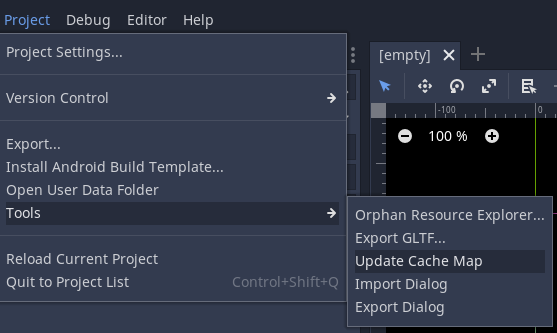
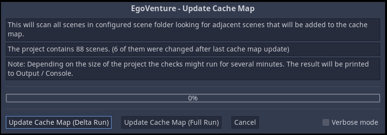
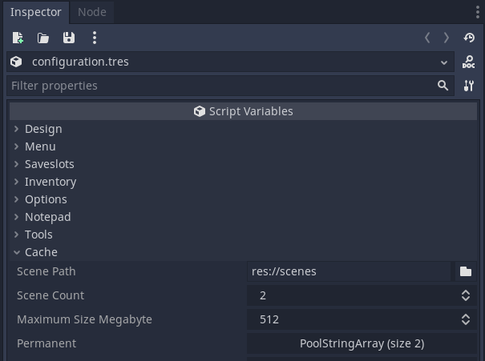

# Caching of scenes and update of *EgoVenture* cache map

## Caching

Because changing scenes - especially with large images - takes time, *EgoVenture* includes a scene caching that preloads upcoming scenes in the background based on a generated cache map.

To generate a cache map choose the Godot menu item Project > Tools > Update Cache Map.



This opens a dialog box giving an overview how many scenes the game contains in the scene path folder (default: `res://scenes`) and how many have been changed since the time the cache map was last updated.



There are 3 options available:

* Choose "Update Cache Map (Delta Run)" to update the cache map for the changed scenes only. This is the default option to keep the cache map up to date.

* Choose "Update Cache Map (Full Run)" to update the cache map for all scenes. This will regenerate the complete cache map for all scenes and should be selected if scenes were deleted from the game.

* Choose "Cancel" to close the dialog box without updating the cache map.

The result of the update run can be seen in the "Output" console. By selecting the "Verbose mode" additional log details are written to the output.

## How is the cache map generated?

Each scene is scanned for textures/images contained in sprites. The sum of the raw size of these textures serves as an estimation of the scene size in memory.

In addition the *adjacent* scenes of a scene are retrieved by:

* reading the target scenes from *EgoVenture* Hotspots and WalkHotspots (Map Hotspots are excluded).

* scanning the GDScript assigned to the scene for usage of target scene name patterns `res://<scene_path>/<scene_name>.tscn` (comments are excluded)

For each scene the raw texture size in kilobytes and an array of its adjacent scenes is stored in the cache map resource `res://cache_map.tres`

## How to include additional adjacent scenes in cache map

The scan might miss adjacent scenes. For example if they are called dynamically. Therefore it is possible to enforce that adjacent scenes get added to the cache map by using the pragma `#EVcache-include` in the assigned GDScript of a scene.

Example: You would like to add scene `res://scenes/example/b.tscn` as an adjacent scene of scene `res://scenes/example/a.tscn`.
To do so include
```gdscript
#EVcache-include res://scenes/example/b.tscn
```
somewhere in the script `res://scenes/example/a.gd`.

## How to exclude adjacent scenes from cache map

A similar option is available to exclude adjacent scenes by using the pragma `#EVcache-exclude`.

Example: Scene `res://scenes/example/a.tscn` contains a WalkHotspot with target scene `res://scenes/example/c.tscn`.
To prevent that this target scene gets added as an adjacent scene to the cache map add
```gdscript
#EVcache-exclude res://scenes/example/c.tscn
```
somewhere in the script `res://scenes/example/a.gd`.

## Cache configuration 



The following Cache configuration options can be set in the [Game configuration](configuration.md):

* Scene Path: Folder in which the scenes are stored (default: `res://scenes`)

* Scene Count: This indicates to which depth adjacent scenes are stored in the cache (default: 2)
Example: A Scene Count of 2 means that for a scene 

  * all adjacent scenes are cached

  * and all adjacent scenes of these adjacent scenes

* Maximum Size Megabyte: This indicates the maximum size the scene cache can have. (default: 512 MB)
  > Note: As the scene size is estimated by the texture size the real cache size can be bigger.

* Permanent: In this array it is possible to specify scenes that should always be cached.
For example to cache the main menu `res://scenes/menu.tscn`.
  > Note: The permanent cached scenes are not considered when calculating the cache size.

> [!TIP]
> Increasing "Scene Count" slows down loading time when switching to a new location or when loading a savegame as more scenes need to be cached. A value of 2 should be sufficient for seamless scene changes.

> [!TIP]
> If your game should run on older devices where the overall memory consumption must not exceed 1 GB, recommendation
> is to lower "Maximum Size Megabyte" to 256.
> If the game is released for newer devices increasing "Maximum Size Megabyte" reduces the amount of cache unload/load
> events. Recommendation is to set "Maximum Size Megabyte" to 2048 (= 2 GB) if the game is allowed to consume 3 GB
> memory (main memory + graphics card memory). 


