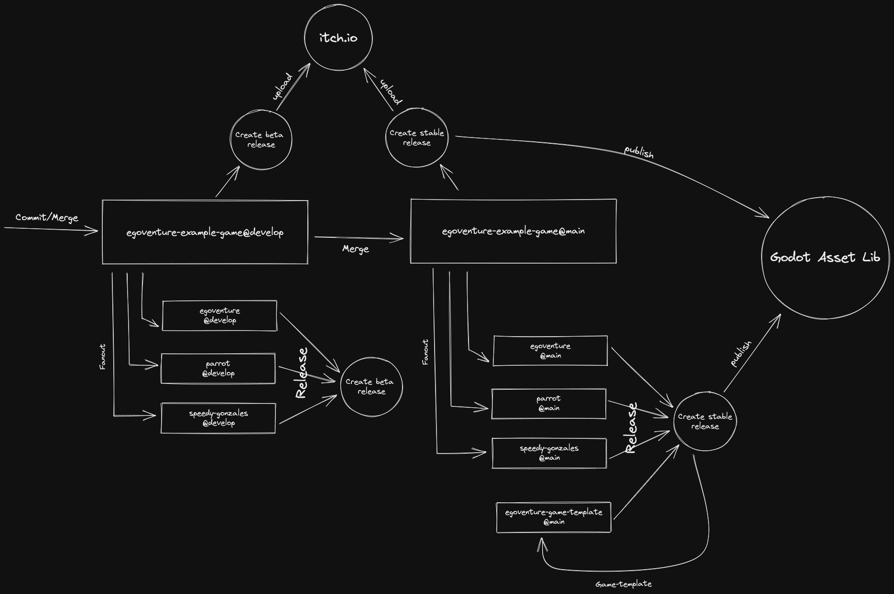

[](https://discord.gg/T6y6KG4V5K)

# First person point and click adventure framework for Godot

## Introduction

*EgoVenture* is a [Godot](https://godotengine.org) framework written in Gdscript for creating first person pont and click adventure games like [the Carol Reed games by MDNA games](https://mdna-games.com/) for mouse- and touch-based games.

Actually, this engine was originally made by MDNA games together with deep entertainment and is used for the Carol Reed series since 2021.

It's streamlined for their games, but may be of use for other developers as well. Thus we're releasing it as Open Source under the [MIT license](LICENSE).

If you want to see all the features, EgoVenture provides, check out the [egoventure-example-game "Carol Refurbished"](https://github.com/deep-entertainment/egoventure-example-game).

```{toctree}
--- 
titlesonly:
hidden:
---

docs/getting_started.md
docs/structure.md
docs/state.md
docs/scenes.md
docs/inventory.md
docs/hotspots.md
docs/sound.md
docs/configuration.md
docs/hints.md
docs/tools.md
docs/theming.md
docs/updating.md
docs/api/index
```

## Development

If you find bugs or need more features, please [file an issue within this repository](https://github.com/deep-entertainment/issues/issues). 

As this framework is used internally at Mdna Games, we'll have to consider each new feature.

If a new feature doesn't match or contradicts our needs, we might refuse to accept it, but we welcome you to fork this repository and implement it yourself.

You're welcome to open pull requests about bugs or (confirmed) features any time and we'll review it and might ask you for modifications. Thank you for your work!

The [release-process](docs/images/release-process.excalidraw.md) can be visualized like this:



All parts of the release process concentrate around the demo game. On commits on `develop` or `main`, the Github actions will fan out changes of the included addons to their own respective repositories. This will trigger a release on those repositories, which in turn will put the updated versions in the game template, which itself will trigger a release of the game template.

Releases in the `main` branch will also release new versions to the Godot Asset Lib.

The game itself will release versions on itch.io for `develop` and `main` changes.

## Logo

Logo based on ["Brown eye" by secretlondon on OpenClipart](https://openclipart.org/detail/27539/brown-eye)
